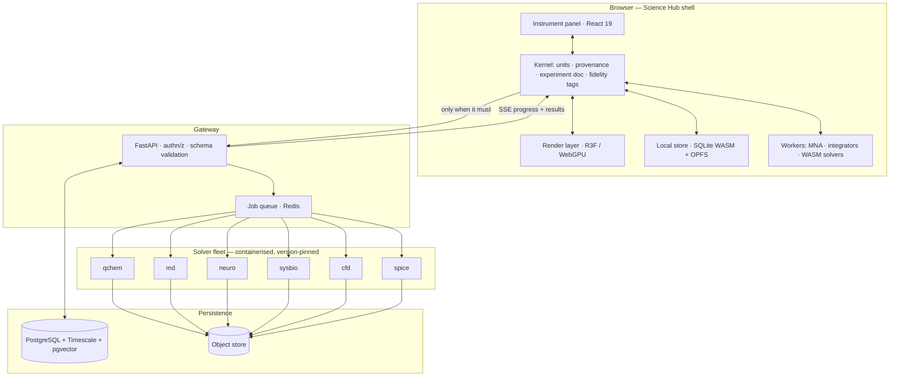

# Science Hub — Architectural Blueprint

**Status:** proposal · **Scope:** Physics, Chemistry, Biology · **Audience:** enthusiasts *and* researchers
**Baseline:** the existing Science Lab (33 tools, 63 engine tests) is Phase 0 of this plan.

---

## 0. Three constraints to settle before anything else

A blueprint that dodges these produces a demo that impresses for ten minutes and fails the
first researcher who checks it against a reference. Each has an engineering answer.

### 0.1 "Real-time" and "exact" are a trade-off, not a pair of adjectives

Every simulation sits somewhere on a curve between interactive frame rates and physical
fidelity. The honest move is to choose a point *per domain*, label it in the UI, and never
let a plausible-looking animation masquerade as a result.

| Domain | Real-time tier (60 fps, browser) | Reference tier (server, minutes–hours) |
|---|---|---|
| Rigid-body / kinematics | Semi-implicit Euler, sub-stepped | Analytic solution where one exists |
| Orbital mechanics | Symplectic (WHFast-class), energy drift < 1e-9 / orbit | IAS15-class adaptive, machine precision |
| Circuits | Modified Nodal Analysis, sparse LU, ~1 kHz update | Full SPICE transient + Monte-Carlo tolerance sweeps |
| Fluids | FLIP/PIC or SPH on WebGPU — *visually plausible* | Finite-volume CFD (OpenFOAM), validated meshes |
| Quantum chemistry | Semi-empirical (tight-binding) single molecules | DFT / coupled-cluster via PySCF, Psi4 |
| Physiology | Reduced ODE models (Hodgkin–Huxley, windkessel) | Full CellML/SBML models, tissue-scale FEM |

**Architectural consequence:** every simulation result carries a `fidelity` tag
(`illustrative | quantitative | reference`) that propagates into the UI and into any export.
A fluid sim that is beautiful but not quantitative says so on the canvas. This single rule is
what separates a research instrument from an edutainment product.

### 0.2 "Medical-grade anatomy" is a data-licensing problem, not a rendering problem

No amount of shader work produces anatomical accuracy. You need scanned, labelled source
geometry. I previously said this meant commercial licensing; that was incomplete — there are
credible open sources:

| Source | Licence | What it gives |
|---|---|---|
| **BodyParts3D** (RIKEN) | CC BY-SA 2.1 JP | ~3,000 labelled organ/bone meshes, FMA-linked |
| **Z-Anatomy** | CC BY-SA | Blender-native full-body atlas, derived from BodyParts3D |
| **OpenAnatomy** (SPL/Slicer) | CC BY / CC BY-SA | Atlases derived from real imaging, segmentation-backed |
| **Visible Human** (NLM) | Licence required | The classic cryosection dataset |
| **BodyParts3D → FMA** | — | Foundational Model of Anatomy ontology for naming |

Two hard implications. **Share-alike is viral**: CC BY-SA source geometry constrains how you
licence derived assets — settle this with counsel before the pipeline is built, not after.
And **cellular/molecular scale is not in these atlases**; it must be procedurally generated
(as this repo already does for the airway tree) or sourced from PDB/EMDB. The "zoom from body
to molecule" experience is therefore a *hand-off between three different data regimes*, not
one continuous mesh — see §2.4.

### 0.3 PhD-level quantum chemistry does not run in a browser tab

A DFT calculation on a 50-atom molecule is minutes of optimised Fortran/C++ against tuned
BLAS. Reimplementing that in JavaScript would be both slower and less trustworthy. The rule:

> **Never reimplement a solver that the field has already validated.** Wrap it, version it,
> and record which version produced each number.

Browser gets: geometry, visualisation, semi-empirical and closed-form work.
Server gets: PySCF, Psi4, xtb, RDKit, OpenMM, NEURON, OpenFOAM — each containerised.

---

## 1. Ideal tech stack

### 1.1 Frontend

| Layer | Choice | Why this and not the obvious alternative |
|---|---|---|
| Language | **TypeScript**, `strict` | Unit/dimension safety is enforceable in the type system (§4.2) |
| Build | **Vite** + **pnpm workspaces** + **Turborepo** | Fast HMR matters when tuning shaders; monorepo keeps engines publishable |
| UI | **React 19** | Not for the canvas — for the *instrument panel* around it, which is where the complexity actually is |
| 3D scene | **React Three Fiber** + **drei** | Declarative scene graphs pay off once scenes are UI-driven; see the caveat below |
| Renderer | **WebGPU**, WebGL2 fallback | Compute shaders are the unlock for N-body and fluids; three.js `WebGPURenderer` covers both |
| State | **Zustand** (UI) + plain mutable buffers (sim) | Simulation state must *never* live in React state |
| Compute isolation | **Web Workers** + **Comlink**, `SharedArrayBuffer` | Keeps the main thread free; COOP/COEP headers required |
| Heavy client compute | **WebAssembly** (Emscripten / wasm-pack) | RDKit.js is the proven precedent; SIMD + threads where available |
| Charts | Keep the existing bespoke SVG layer; **VisX** if it outgrows it | Recharts/Chart.js impose their own aesthetics and fight a design system |
| Math typesetting | **KaTeX** | Faster than MathJax, sufficient coverage |
| Molecular viz | **3Dmol.js** or **NGL** for PDB-scale | Do not hand-roll ribbon diagrams and surface meshing |
| Cheminformatics | **RDKit.js** (WASM) | SMILES/InChI parsing, ETKDG conformers, 2D depiction |

> **The R3F caveat, stated plainly.** React Three Fiber is right for scenes whose *structure*
> is driven by UI state, and wrong for per-frame numerical work. The discipline: simulation
> arrays live outside React; `useFrame` mutates `InstancedMesh` matrices and typed attributes
> directly; nothing that changes at 60 Hz ever calls `setState`. Where a sandbox is
> essentially one big simulation with a thin UI (the fluid tank, the N-body view), drop to
> imperative three.js inside a single R3F node. Adopting R3F is a decision to accept this
> discipline, and it belongs in the contributor guide, not in tribal memory.

### 1.2 Backend

| Layer | Choice | Rationale |
|---|---|---|
| API | **Python 3.12 + FastAPI**, Pydantic v2 | The scientific ecosystem is Python; async I/O suits job orchestration |
| Job queue | **Dramatiq** or **Arq** + **Redis** | Simpler operationally than Celery for this shape of workload |
| Solver isolation | **One container per solver**, pinned versions | Reproducibility: `pyscf==2.x` is part of the result's identity |
| Orchestration | **Kubernetes** (managed), **Docker Compose** for local/on-prem | On-prem matters for labs that cannot send data out |
| Gateway | Envoy or Traefik | mTLS between services, per-tenant rate limits |
| Object store | **S3-compatible** (MinIO on-prem) | Trajectories and wavefunctions are large binary blobs |
| Streaming | **NATS** or Redis Streams | Progress and partial results pushed to the client over SSE/WebSocket |

**Solver containers** (illustrative, each versioned and hash-pinned):

| Container | Wraps | Serves |
|---|---|---|
| `qchem` | PySCF, Psi4, xtb | SCF/DFT energies, geometry optimisation, orbitals, spectra |
| `cheminf` | RDKit, Open Babel | Structure normalisation, conformers, descriptors |
| `md` | OpenMM | Molecular dynamics, solvation, free-energy |
| `neuro` | NEURON, Brian2 | Multi-compartment neurons, network models |
| `sysbio` | libRoadRunner, COPASI | SBML/CellML pathway and physiology models |
| `cfd` | OpenFOAM | Reference fluid dynamics (batch only, never interactive) |
| `spice` | ngspice | Reference circuit validation against the in-browser MNA |

### 1.3 Data layer

| Store | Technology | Holds |
|---|---|---|
| Relational | **PostgreSQL 16** | Users, experiments, provenance, constants registry |
| Time series | **TimescaleDB** | Simulation traces, sensor/instrument imports |
| Vector | **pgvector** | Literature RAG embeddings — same DB, one fewer moving part |
| Blob | S3 / MinIO | Trajectories, meshes, volumetric fields, wavefunctions |
| **Client-local** | **SQLite WASM + OPFS** | Local-first experiment store, works fully offline |
| Sync | **Automerge** or **Yjs** (CRDT) | Conflict-free merge of experiment edits across devices |
| Cache | Redis | Job dedup by input hash — identical inputs never recompute |

### 1.4 The AI layer, and a rule about it

Local/multi-modal AI earns its place in three roles — and is barred from a fourth.

1. **Natural-language experiment setup.** "Titrate 0.1 M HCl into 25 mL of 0.1 M NaOH" →
   a validated experiment document (§4.3). The model emits *structured tool calls*, never prose
   results.
2. **Result interpretation.** Given a computed spectrum, explain the peaks — with every number
   quoted from the solver output, not generated.
3. **Literature grounding.** RAG over ingested papers via pgvector, with citations.

> **The rule: the model never produces a number that reaches the user.** It selects and
> parameterises deterministic solvers, and it narrates their output. Any figure in the UI is
> traceable to a solver run ID or a constants-registry entry. Violating this makes the whole
> platform scientifically worthless, so it is enforced structurally: the rendering layer
> accepts `Quantity` objects (§4.2) that only solvers and the registry can mint.

Deployment: **Ollama** or **vLLM** server-side for lab-local inference; **WebLLM** for a
fully offline tier; a hosted frontier model where the tenant permits it.

---

## 2. System architecture

### 2.1 The unifying idea: three subjects, one kernel

The three modules must not be three applications sharing a navbar. What genuinely unifies them
is that **every tool is a function from a typed, unit-checked input document to a result
document with provenance**. Physics, chemistry and biology differ in their solvers, not in
their lifecycle.



**Local-first is the default.** The client computes everything it can and only escalates to
the server when a job genuinely needs a reference solver. That gives offline capability, makes
the enthusiast tier free to run, and means a lab can deploy the whole stack air-gapped.

### 2.2 The module contract

Every tool in every subject implements one interface. This is what makes a fourth subject
(earth science, astronomy) an additive change rather than a refactor.

```ts
interface ScienceModule<Input, Result> {
  id: string;                                  // "chem.mixture", "phys.circuit"
  subject: "physics" | "chemistry" | "biology";
  inputSchema: JSONSchema;                     // validated both sides of the wire
  fidelity: "illustrative" | "quantitative" | "reference";

  /** Runs in a Worker. Must be pure and deterministic given the same seed. */
  compute(input: Input, ctx: ComputeContext): Promise<Result>;

  /** Optional escalation to a server solver. */
  remote?: { solver: string; estimateCost(input: Input): CostEstimate };

  /** Scene description — never raw three.js objects, so views stay swappable. */
  scene?(result: Result): SceneGraph;

  /** Golden-value regression cases. Non-optional by policy. */
  validation: ValidationCase[];
}
```

`validation` being mandatory is a deliberate governance choice: a module that cannot state
what it should produce for known inputs does not ship.

### 2.3 Cross-module interaction — where the hub earns its name

Three subjects in one shell is only worth building if results flow *between* them. Concretely:

- **Chemistry → Biology.** A ligand built in the mixture sandbox is dropped into a protein
  binding site; the MD container scores it. Shared representation: the molecular graph.
- **Physics → Chemistry.** An emission spectrum computed by `qchem` is fed to the optics
  sandbox as a real light source and refracted through a prism. Shared representation:
  spectral power distribution.
- **Biology → Physics.** The cardiovascular model exports vessel geometry and pressures to
  the fluid sandbox for wall-shear-stress estimation. Shared representation: mesh + boundary
  conditions.

These work only because all three speak the same `Quantity` and provenance types. That is the
argument for building the kernel before the modules.

### 2.4 The anatomy zoom, honestly engineered

"Zoom from body to molecule" spans ~9 orders of magnitude (1 m → 1 Å). No single scene graph
survives that. The design is a **scale-band pipeline** with explicit hand-offs:

| Band | Range | Representation | Source |
|---|---|---|---|
| Organism | 1 m – 1 cm | Decimated static meshes + LOD | BodyParts3D / Z-Anatomy |
| Organ | 1 cm – 100 µm | Segmented meshes, cutaway planes | Atlas + procedural vasculature |
| Tissue | 100 µm – 10 µm | Procedural (Weibel-style generative rules) | Morphometric models |
| Cell | 10 µm – 100 nm | Procedural organelles, instanced | Literature parameters |
| Molecular | 100 nm – 1 Å | PDB structures, ribbon/surface | RCSB PDB, EMDB |

Transitions are **cross-faded, camera-driven swaps** with a physically labelled scale bar,
not a continuous mesh. Each band is streamed and unloaded independently (a `SceneBudget`
enforces a GPU memory ceiling). Dynamic processes attach to whichever band is resident:
blood oxygenation at organ scale, a synapse at cell scale, an ion channel at molecular scale.

---

## 3. UI/UX

### 3.1 Design stance

The existing app's instrument-panel language — dark laboratory ground, one accent hue per
subject, results as monospaced chips beside the visual, working shown as steps — already suits
a research tool and carries forward. What changes at hub scale:

- **A workspace, not a page.** Dockable, resizable panels; layouts persist per tool and per user.
- **Dual-mode disclosure.** One switch, *Explore* ↔ *Research*, changes density rather than
  capability: Explore leads with the visual and plain-language narration; Research leads with
  parameters, uncertainties, solver identity and the export button. Never two codebases.
- **Provenance is always one click away.** Any number opens a popover: source, uncertainty,
  solver + version, input hash.
- **Fidelity is never hidden.** A persistent badge on every canvas: *illustrative* /
  *quantitative* / *reference*.

### 3.2 Hub dashboard

```
┌────────────────────────────────────────────────────────────────────────────────┐
│ ⚗ SCIENCE HUB    [Physics] [Chemistry] [Biology]        ⌘K  ◐ theme  ◉ Research│
├──────────────┬─────────────────────────────────────────────────────────────────┤
│ WORKSPACES   │  Continue                                                       │
│ ▸ Recent     │  ┌────────────────┐┌────────────────┐┌────────────────┐         │
│   Titration  │  │ Titration run  ││ Bandgap: GaAs  ││ Cardiac output │         │
│   GaAs DFT   │  │ ▸ quantitative ││ ▸ reference    ││ ▸ quantitative │         │
│   Cardiac    │  │ 2 min ago      ││ queued · 4 min ││ yesterday      │         │
│              │  └────────────────┘└────────────────┘└────────────────┘         │
│ ▸ Saved      │                                                                 │
│ ▸ Shared     │  Jobs                                    Constants registry     │
│ ▸ Templates  │  ┌──────────────────────────────┐  ┌──────────────────────────┐ │
│              │  │ ● qchem/psi4  B3LYP/6-31G*   │  │ CODATA 2022   ✓ current  │ │
│ SUBJECTS     │  │   GaAs slab · 62%  ▓▓▓▓▓░░   │  │ IUPAC 2021    ✓ current  │ │
│ ⚛ Physics    │  │ ○ md/openmm   solvation      │  │ NIST ASD      ✓ synced   │ │
│ 🧪 Chemistry │  │   queued · est. 11 min       │  │ PDB mirror  ⟳ 3 days old │ │
│ 🧬 Biology   │  └──────────────────────────────┘  └──────────────────────────┘ │
│              │                                                                 │
│ ⌘K → "titrate 0.1 M HCl into NaOH"  → builds a validated experiment document   │
└──────────────┴─────────────────────────────────────────────────────────────────┘
```

The command palette is the AI entry point, and it produces *an editable experiment document* —
the user always sees and can correct what the model proposed before anything runs.

### 3.3 Chemistry Mixture Sandbox — the reference workspace

```
┌────────────────────────────────────────────────────────────────────────────────┐
│ ◀ Chemistry / Mixture Sandbox — "Silver halide precipitation"   ⬤ quantitative │
├───────────────┬──────────────────────────────────────────┬─────────────────────┤
│ REAGENTS      │            BENCH (3D, WebGPU)            │ ANALYSIS            │
│ ┌───────────┐ │                                          │ ┌─────────────────┐ │
│ │ 🔍 search │ │        ╭──────────────────╮              │ │ Predicted        │ │
│ └───────────┘ │        │    ▒▒▒▒▒▒▒▒▒▒    │  ← beaker    │ │ AgNO₃ + NaCl →   │ │
│               │        │   ▒ cloudy   ▒   │    volumetric│ │ AgCl↓ + NaNO₃    │ │
│ ▸ Solutions   │        │   ▒ white    ▒   │    render    │ │                  │ │
│   AgNO₃ 0.1M  │        │    ╲▒▒▒▒▒▒▒╱     │              │ │ Ksp 1.77×10⁻¹⁰   │ │
│   NaCl  0.1M  │        │     ╲_____╱      │              │ │ Q  2.50×10⁻³     │ │
│   HCl   1.0M  │        ╰──────────────────╯              │ │ Q ≫ Ksp → solid  │ │
│               │                                          │ │                  │ │
│ ▸ Solids      │   ┌────────────────────────────────┐     │ │ ΔH  −65.5 kJ/mol │ │
│ ▸ Gases       │   │ molecular inset · Ag⁺ + Cl⁻    │     │ │ ΔG  −55.7 kJ/mol │ │
│               │   │ lattice nucleation             │     │ │ K   6.2×10⁹      │ │
│ DRAG TO ADD   │   └────────────────────────────────┘     │ └─────────────────┘ │
│               │                                          │                     │
│ CONDITIONS    │  ▶ ⏸ ⏮   t = 4.20 s   ×0.25 speed        │ [Species] [Energy]  │
│ T  298.15 K   │  ═══════════════▓══════════════════      │ [Spectra] [Log]     │
│ p  101.325 kPa│                                          │                     │
│ V  50.00 mL   │  Observations (auto-logged)              │ ⓘ Ksp: NIST 46 v8   │
│ stir ▓▓▓░░    │  • 4.10 s  white precipitate forms       │   ± 0.03×10⁻¹⁰      │
│               │  • 4.18 s  suspension opaque             │   [cite] [export]   │
└───────────────┴──────────────────────────────────────────┴─────────────────────┘
```

**Interaction model.** Drag a reagent onto the beaker → the kernel resolves species, runs
speciation/equilibrium, and *only then* does the renderer act. The visual is downstream of the
chemistry, exactly as the current heart's valves are downstream of pressure.

**How the reaction is decided** (no hard-coded animation table):

1. **Species resolution** — reagents → ions/molecules via the compound registry.
2. **Reaction candidates** — matched from a curated reaction-rule database (precipitation via
   solubility rules, acid–base, redox via standard potentials, complexation).
3. **Thermodynamic gate** — compute Q vs K, ΔG from tabulated ΔH_f/S°; reject non-spontaneous.
4. **Kinetics** — Arrhenius rates where measured, else flag as *illustrative* timing.
5. **Observable mapping** — a typed record of what a human would see: precipitate (colour,
   turbidity), gas (bubble rate), colour change (via absorption spectrum), temperature change.
6. **Render** — the observable record drives shaders. The renderer knows nothing of chemistry.

That last separation is what makes the sandbox extensible: adding a reaction adds data, not
animation code.

### 3.4 Circuit builder

Drag-and-drop schematic capture; the netlist is the document. Live **Modified Nodal Analysis**
in a Worker: DC operating point by Newton–Raphson, AC by complex-phasor MNA sweeps, transient
by trapezoidal companion models with adaptive time-stepping. Probes attach to nodes and stream
into scope panels. Every result is checkable against the `spice` container — a one-click
"verify against ngspice" that diffs the two. **Being auditable against the field's standard
tool is a feature, and it should be visible in the UI.**

---

## 4. Data structures

### 4.1 Constants registry — provenance as a first-class citizen

The single most important schema in the system. A PhD-grade platform is distinguished by
knowing *where every number came from and how uncertain it is*.

```sql
CREATE TABLE constant (
  id                TEXT PRIMARY KEY,              -- 'codata.2022.planck'
  symbol            TEXT NOT NULL,                 -- 'h'
  name              TEXT NOT NULL,
  value             DOUBLE PRECISION NOT NULL,
  std_uncertainty   DOUBLE PRECISION,              -- NULL ⇒ exact by definition
  relative_uncertainty DOUBLE PRECISION,
  is_exact          BOOLEAN NOT NULL DEFAULT FALSE,
  unit              TEXT NOT NULL,                 -- 'J s'
  dimension         SMALLINT[7] NOT NULL,          -- SI exponents [m,kg,s,A,K,mol,cd]
  source_id         TEXT NOT NULL REFERENCES source(id),
  valid_from        DATE NOT NULL,                 -- CODATA revisions supersede
  superseded_by     TEXT REFERENCES constant(id),
  CHECK (is_exact OR std_uncertainty IS NOT NULL)
);

CREATE TABLE source (
  id           TEXT PRIMARY KEY,                   -- 'codata.2022'
  title        TEXT NOT NULL,
  publisher    TEXT NOT NULL,                      -- 'NIST', 'IUPAC'
  doi          TEXT,
  url          TEXT,
  retrieved_at TIMESTAMPTZ NOT NULL,
  checksum     TEXT NOT NULL                       -- of the ingested payload
);
```

The `dimension` array is the key to correctness: it enables machine-checked dimensional
analysis at ingest *and* at every arithmetic step (§4.2). `valid_from` + `superseded_by` means
a five-year-old experiment can be re-run against the constants it originally used —
reproducibility that most educational platforms simply do not offer.

Element data extends this pattern:

```jsonc
{
  "atomicNumber": 47,
  "symbol": "Ag",
  "standardAtomicWeight": { "value": 107.8682, "uncertainty": 0.0002, "source": "iupac.2021" },
  "electronConfiguration": {
    "notation": "[Kr] 4d10 5s1",
    "experimental": true,                    // Ag is an aufbau exception
    "source": "nist.asd.v5"
  },
  "radii": {
    "covalent":  { "value": 145, "unit": "pm", "source": "cordero.2008" },
    "vanDerWaals": { "value": 172, "unit": "pm", "source": "bondi.1964" }
  },
  "isotopes": [
    { "massNumber": 107, "mass": 106.9050916, "abundance": 0.51839, "halfLife": null },
    { "massNumber": 109, "mass": 108.9047553, "abundance": 0.48161, "halfLife": null }
  ],
  "emissionLines": [
    { "wavelength": 328.068, "unit": "nm", "relativeIntensity": 1.0,
      "transition": "4d¹⁰5p ²P°₃⁄₂ → 4d¹⁰5s ²S₁⁄₂", "source": "nist.asd.v5" }
  ]
}
```

### 4.2 Quantities — units in the type system

```ts
/** SI exponents: [m, kg, s, A, K, mol, cd] */
type Dimension = readonly [number, number, number, number, number, number, number];

interface Quantity<D extends Dimension> {
  readonly value: number;
  readonly unit: string;
  readonly dimension: D;
  readonly uncertainty?: number;         // 1σ, propagated through arithmetic
  readonly provenance: ProvenanceRef;    // constant id | solver run id | user input
}
```

Arithmetic helpers add/subtract only on matching dimensions (a compile-time error otherwise)
and propagate uncertainty in quadrature. This makes the Mars-Climate-Orbiter class of bug
structurally impossible, and it is why `Quantity` is minted only by solvers and the registry —
the LLM layer physically cannot fabricate one.

### 4.3 Experiment document

The unit of saving, sharing, versioning and reproduction.

```jsonc
{
  "id": "exp_01HQ...",
  "schemaVersion": "1.2.0",
  "title": "Silver halide precipitation",
  "module": "chem.mixture",
  "fidelity": "quantitative",
  "createdBy": "usr_...",
  "visibility": "private",                 // private | team | public
  "encryption": { "scheme": "AES-GCM-256", "wrappedKey": "..." },

  "inputs": {
    "temperature": { "value": 298.15, "unit": "K", "dimension": [0,0,0,0,1,0,0] },
    "reagents": [
      { "compound": "AgNO3", "concentration": { "value": 0.1, "unit": "mol/dm^3" },
        "volume": { "value": 25, "unit": "mL" } },
      { "compound": "NaCl",  "concentration": { "value": 0.1, "unit": "mol/dm^3" },
        "volume": { "value": 25, "unit": "mL" } }
    ]
  },

  "execution": {
    "solver": "kernel.chem.equilibrium",
    "solverVersion": "1.4.2",
    "containerDigest": null,               // set for server solvers
    "seed": 20260806,
    "inputHash": "sha256:...",             // dedup + cache key
    "startedAt": "2026-08-06T23:40:00Z",
    "durationMs": 412
  },

  "results": {
    "reactions": [{ "equation": "AgNO3 + NaCl -> AgCl + NaNO3",
                    "Q": 2.5e-3, "Ksp": 1.77e-10, "spontaneous": true }],
    "observables": [{ "type": "precipitate", "species": "AgCl",
                      "colour": "#f2f2ef", "onsetSeconds": 4.10 }],
    "artifacts": [{ "kind": "trace", "uri": "s3://.../species.parquet" }]
  },

  "provenance": {
    "constants": ["nist.sol.46.agcl", "codata.2022.gas"],
    "citations": ["doi:10.1021/..."]
  },

  "audit": [{ "at": "...", "actor": "usr_...", "action": "created" }]
}
```

`inputHash` gives free memoisation: an identical experiment never recomputes, which matters
when a class of 200 students runs the same titration.

### 4.4 Security and data flow

Threat model: **proprietary research setups and unpublished results.**

- **Local-first by default.** Experiments live in client SQLite/OPFS; nothing leaves the device
  unless a server solver is explicitly invoked or the user syncs.
- **End-to-end encryption for private work.** Per-experiment content key via WebCrypto, wrapped
  with the user's key; the server stores ciphertext. Sync and backup are zero-knowledge.
- **The escalation prompt is explicit.** Sending a structure to `qchem` shows exactly what
  will be transmitted. For sensitive work, on-prem deployment keeps it inside the network.
- **Tenant isolation** at the database level (Postgres RLS) *and* the container level.
- **Signed provenance.** Result documents are signed by the solver container's key, so a
  published figure can be verified as genuinely produced by that solver version.
- **SBOM + pinned digests** for every solver image; supply chain is part of reproducibility.
- **COOP/COEP** headers for `SharedArrayBuffer`, strict CSP, WASM from same-origin only.

---

## 5. Phase 1 execution plan

**Objective:** de-risk the three things that can kill this project, and turn the existing app
into the hub's first module — without a rewrite.

**Explicitly not in Phase 1:** the anatomy atlas, fluid dynamics, the AI layer, multi-user.
Each depends on foundations that do not exist yet.

### Weeks 1–2 · Extract the kernel

- Monorepo: `pnpm` workspaces, `@hub/*` packages, TypeScript strict, Vite.
- Port the existing engines (`chemistry-core`, `physics-core`, `biology-core`,
  `molecule-core`, `orbital-core`, `anatomy-core`) to TypeScript **unchanged in behaviour** —
  the 63 existing tests are the regression net and must stay green throughout.
- Implement `@hub/units`: `Quantity`, dimension arithmetic, uncertainty propagation.
- Implement the constants registry schema; ingest CODATA 2022 + IUPAC 2021 with provenance.

*Exit criteria:* existing tests pass against the TS engines; every constant in the app carries
a source and an uncertainty; a dimension error fails to compile.

### Weeks 3–4 · The validation harness (do this before new features)

- Golden-value suites per domain, from authoritative references: NIST WebBook thermochemistry,
  ngspice for circuits, published Hodgkin–Huxley traces, CODATA-derived identities.
- CI runs engine tests, golden values, and the browser suite on every push.
- A published **accuracy report** — per module: what it computes, against what reference, to
  what tolerance, with what known limitations.

*Exit criteria:* CI green on GitHub Actions; the accuracy report is generated, not written by
hand. *This is the artefact that makes a researcher trust the platform, and it is cheap now
and expensive later.*

### Weeks 5–6 · Rendering spike (highest technical risk)

- WebGPU renderer path with WebGL2 fallback; capability detection and honest degradation.
- Compute-shader N-body: 10⁵ particles at 60 fps, symplectic, with energy drift plotted live.
- Port one existing 3D view (the crystal lattice, via `InstancedMesh`) to R3F to prove the
  discipline in §1.1 and to write the contributor guide from real experience.
- Benchmark on a mid-range laptop iGPU and a phone — not just the dev machine.

*Exit criteria:* documented frame budgets; measured energy drift; a written R3F/imperative
boundary rule.

### Weeks 7–8 · One vertical slice, end to end

Choose the **Chemistry Mixture Sandbox**, because it exercises every layer: registry lookups,
equilibrium computation, an observable-mapping layer, WebGPU rendering, local persistence, and
a server escalation.

- Reaction-rule database + speciation and equilibrium solver (client-side).
- Observable mapping → shader parameters.
- Experiment document save/load in SQLite WASM; export/import as a signed bundle.
- **One** server round trip: `qchem` container computing an absorption spectrum, with progress
  streamed over SSE and results cached by `inputHash`.

*Exit criteria:* a user drags two reagents together, sees a physically-gated reaction, opens
provenance on any number, saves it, reloads offline, and escalates one calculation to the
server.

### Weeks 9–10 · Harden and decide

- Auth, tenant isolation, E2EE for private experiments.
- On-prem Docker Compose deployment proven on a clean machine.
- Load test the queue; establish cost per solver-minute.
- **Go/no-go review** on the anatomy atlas: licence position confirmed with counsel, asset
  pipeline prototyped (BodyParts3D → decimated glTF + Draco/meshopt), scale-band budget measured.

### Team shape

| Role | Count | Focus |
|---|---|---|
| Scientific software architect | 1 | Kernel, contracts, validation policy |
| Graphics engineer | 1–2 | WebGPU, R3F discipline, LOD and streaming |
| Backend / infra | 1 | Solver fleet, queue, on-prem story |
| Domain scientists | 3 × part-time | One per subject: model choice and *sign-off on the accuracy report* |
| UI/UX designer | 1 | Instrument-panel system, dual-mode disclosure |

Domain-scientist sign-off is not a nicety. It is the mechanism by which "PhD-level" stops being
a marketing claim.

### Risk register

| Risk | Severity | Mitigation |
|---|---|---|
| Anatomy licensing blocks the flagship feature | **High** | Settle licences in Phase 1; procedural fallback already proven in this repo |
| WebGPU support gaps on target devices | Medium | WebGL2 fallback path built in week 5, not retrofitted |
| Solver costs scale badly with users | Medium | Aggressive `inputHash` caching; quotas; client-side tier does most work |
| Scope: "PhD-level" everywhere at once | **High** | Fidelity tiers make partial coverage honest rather than embarrassing |
| Accuracy regressions as the surface grows | **High** | Golden-value CI from week 3; no module ships without validation cases |

---

## 6. What carries forward from the current codebase

This is not a greenfield project. The existing app already demonstrates, in production code,
several of the principles above:

| Already proven here | Becomes |
|---|---|
| DOM-free engines, testable under node | The `@hub/*` package boundary |
| Models derived from measured data, angles read *back off* generated geometry | The validation harness pattern |
| Heart valves driven by pressure gradients, not keyframes | The "renderer is downstream of the model" rule |
| Fidelity honesty (idealised assumptions stated per tool) | Formal `fidelity` tags |
| CVD-validated palette, colour never the only cue | The hub design system |
| three.js stage with disposal and frame budgeting | The R3F/imperative boundary |

The main structural gaps to close are **units/provenance** (numbers currently carry neither)
and **persistence** (there is no experiment document yet). Both are Phase 1, weeks 1–2.
